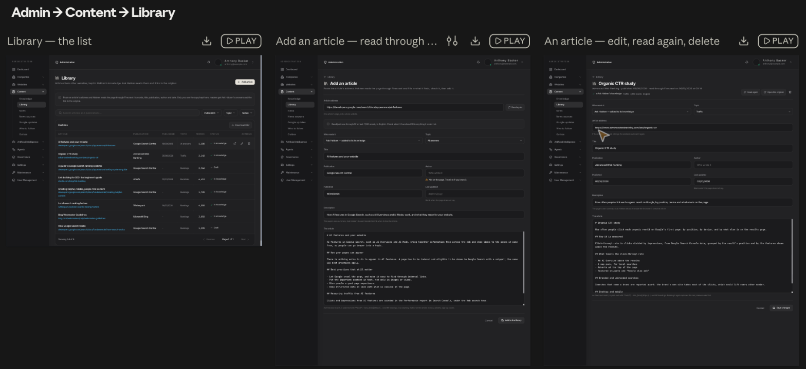

# Library — other websites' articles in Hakken's knowledge — plan, 2026-10-06

A new list in Admin → Content: articles from other websites, read through
Firecrawl and kept whole, with their details, so Ask Hakken can learn from
them and point readers to the original.

**Asked (Anthony, 2026-10-06):** "i want to add this website into the content
section in the admin section · we will need firecrawl to crawl the page and
bring it down into our knowledge · I also need a UI to add / edit and delete
articles like this · we need meta data around the raw article too — title,
publication, date etc". Drawn the same morning; "yes please build it", then
"did you make this a repo plan first" — this plan, written before any code —
and "go".

**Status, 2026-10-06:** built on dev, not committed — every phase below —
and checked with a real article: Anthony's
[Google quality and core updates](https://nachomascort.com/en/blog/google-quality-core-updates/)
(Nacho Mascort), read through Firecrawl (4,349 words), its site's "Skip to
content" link, contents list, related posts and contact form cut by hand,
and added "in knowledge" under Rankings; Ask Hakken's search finds its "How
long does a…" sections for a question about recovering from a core update.
Overall: 100% built; committing and pushing wait for Anthony.

**Configuration:** `FIRECRAWL_API_KEY` set on the dev deployment by Anthony,
2026-10-06. **Not on production** — set it there before this reaches `main`,
or Read the page says Firecrawl is not set up (the News Collector's
websites without a feed wait on the same key).

### Built

- **Phase 1 — data, Read the page, add / change / delete.**
  `convex/libraryArticlesSchema.ts` (`libraryArticles`, `libraryArticleTexts`,
  `libraryArticleSections`), `convex/libraryArticles.ts`,
  `convex/libraryArticleActions.ts`; a page's details from its meta tags in
  `convex/utils/libraryPage.ts`. Firecrawl's fetch is `fetchPage` in
  `convex/webScrapeActions.ts`, shared with the agents' and the News
  Collector's `scrapeUrl`, whose answers are unchanged.
- **Phase 2 — Ask Hakken's copy** (L11–L13): sections replaced on every save,
  searched in `aiChat.generateHakkenResponse` beside the wiki and the
  company's documents.
- **Phase 3 — the screens**: `admin/content/library/` (`page.tsx`,
  `LibraryArticleEditor.tsx`, `new/`, `[articleId]/`), Library in the
  sidebar after Knowledge, both languages. `ContentEditPage` gained a
  record's status labels, header controls and a held Save;
  `useContentDelete` an `onDeleted`; Google updates' day format became the
  shared `formatContentDay`.
- **Phase 4 — checks**: `convex/libraryArticles.test.ts`,
  `convex/utils/libraryPage.test.ts`, `admin/content/library/page.test.tsx`
  and the look test `libraryLook.test.tsx`, its outlines in
  [`look/`](../assets/content-library/look/).
- **Found with the first real article**: a one-person blog's author and
  publication are the same name, so Ask Hakken's heading names it once.
- **Changed from the drawing, in words only**: the Description field's hint
  says what it does ("The page's own summary of itself, searched with the
  title"), since Ask Hakken is given each section's title, publication and
  address rather than the description.

## The approved drawing

Approved 2026-10-06 ("yes please build it"). Binding: a change to this look
is drawn and approved again first (drawing-guide.md).

- The boards, as drawn: [`boards/`](../assets/content-library/boards/) —
  `Library.dc.html` (the list), `AddArticle.dc.html` (adding one, in three
  states: empty, read, could not be read) and `Article.dc.html` (one article).
  Drawn from the drawing kit, stylesheet `9f895f5d001e`, look `149d9f4fb243`;
  each passed `npm run check:drawing`.
- The canvas: https://claude.ai/artifact/4DxLG8VF1cy5fxVq62mwhe
- The example rows are illustrative. The website Anthony meant in "this
  website" did not come through with the message; it is the first open
  question below.

## Decided

| # | Decision |
|---|---|
| L1 | **A new item, "Library", under Admin → Content, after Knowledge.** Knowledge is what the team writes for readers; Library is other websites' articles, kept for Ask Hakken. The name is assumed and Anthony's to change (open question 2). |
| L2 | **One article per address**, never a whole website ("One article's page, not a whole website", as drawn). An address already in the Library is refused, naming the article that has it. |
| L3 | **Adding is a page, never a pop-up** (R1 of the Knowledge plan): paste the address, press **Read the page**, Firecrawl reads it there and then, the fields fill in, the admin checks them and presses **Add to the library**. Nothing is stored until that press. |
| L4 | **The details kept**: the address, title, publication, author, published, last updated, description, topic (Knowledge's four: Traffic, Rankings, AI answers, Backlinks), the article's words (plain text with simple formatting — Firecrawl's Markdown), how many words, the page's language, and when it was last read. A detail the page does not give stays blank; the author's says "Not on the page. Type it in if you know it." |
| L5 | **Two states, "Who reads it"**: *Ask Hakken — added to its knowledge*, or *Draft — kept here only*. |
| L6 | **A page Firecrawl cannot read** (a sign-in or subscription wall, an error, next to no words) says so in plain words, and the article's words can be pasted by hand. |
| L7 | **Readers never see the copy.** Ask Hakken reads it and links to the original. It is not translated: R2 is about what people write for readers, and these are sources, kept in the language they were written in. |
| L8 | **Delete asks yes or no** (`ContentDeleteDialog`) and removes the article, its words and Ask Hakken's copy. |
| L9 | **Read again** (an article's page) asks first, then puts what the page says now into the form; nothing is stored until **Save changes**. |
| L10 | **The list** is the standard one: title, explanation box, the search box with Publication, Topic and Status beside it, the table with its bar (count and Download CSV), 15 rows a page (the admin standard), newest added first. Row actions: open the original, edit, delete. |

## How Ask Hakken reads it

Settled from the code on 2026-10-06, before phase 2 was built. **The Library
is a shelf of its own, searched for every question a signed-in user asks Ask
Hakken; it is never written into the wiki or the knowledge documents.**

| # | Decision |
|---|---|
| L11 | **Its own shelf.** An article in Ask Hakken's knowledge is cut at its headings into sections of at most 3,000 characters (`libraryArticleSections`, with a full-text index). Each question searches them by its words; up to three sections that share at least two of those words reach the answer, within 9,000 characters, each headed with its article's title, publication, date and address so the answer can name and link the original. A draft has no sections. |
| L12 | **Marked as someone else's words.** The sections go in with the wrapper every retrieved document wears (`buildUntrustedKnowledgeContext`): reference material, never instructions — a scraped page is third-party text. |
| L13 | **Signed-in users only.** A visitor using a customer's website widget never gets the Library: it is other publishers' words, and those visitors are the public (L7). |

Why not the two routes that already exist:

- **The global wiki** (how Knowledge articles reach Ask Hakken,
  `knowledgeArticleWiki.ts`): a page holds 4,000 characters, so a Library
  article would be 5 to 15 pages; above 200 global pages the shelf's index
  goes two-stage and Hakken's own product pages start to drop out of it; the
  wiki's text goes into the answer without the untrusted wrapper; and the
  widget reads the global shelf for anonymous visitors.
- **Global knowledge documents** (chunked and embedded, `knowledge.ts`): Ask
  Hakken stopped searching global chunks once the global wiki held pages
  (aiChat.ts, the global-wiki cutover), and a global document is also
  distilled into wiki pages. Using them would mean reopening that cutover — a
  broader change than this feature.

Typed chat only to begin with; the voice session can read the same shelf
later.

## What already exists, and is reused

- **Firecrawl**: `FIRECRAWL_API_KEY` is set up and `webScrapeActions.ts`
  reads one page for agents and the News Collector. Its fetch becomes a
  shared function that also returns the page's details (site name, author,
  dates, language) and takes its own length cap; existing callers are
  unchanged.
- **The Content screens' parts**: `ContentEditPage`, `useContentForm`,
  `useContentDelete`, `ContentDeleteDialog`; the kit's `PageHeader`,
  `PagePrimaryAction`, `Notice`, `DataTable`, `TableBar`, `DownloadButton`,
  `Select` (as chips), `Field`, `TextAreaField`, `StatusLabel`, `TagLabel`,
  `RowActions`, `RowIconButton`.
- `ContentEditPage` is extended, not copied, to carry a record's status
  labels and its own controls (Read again, Open the original, Delete) in its
  header, as `DetailHeader` already allows.
- The topics: `KNOWLEDGE_TOPICS` (`convex/utils/learnLists.ts`).
- Writes: `superAdminQuery` / `superAdminMutation` / `superAdminAction`,
  `auditContentChange`, `checkedText`, `checkedUrl`, `checkedDay`, and
  `validateSafeUrl` for the address.

## The parts

### Data (`convex/libraryArticlesSchema.ts`)

- **`libraryArticles`**: address, title, publication, author, published and
  last updated (`YYYY-MM-DD`), description, topic, status, language, words,
  when last read, created, updated. Indexes by when added and by address.
- **`libraryArticleTexts`**: the article's words, one row per article, kept
  apart so the list never reads them. A Library of a few hundred articles of
  up to 100,000 characters each would otherwise read megabytes on every look
  at the list (the Convex cost review's lesson, October 2026).
- **`libraryArticleSections`**: Ask Hakken's copy (L11) — an article in its
  knowledge, cut at its headings; replaced whole on every save, gone for a
  draft or a deleted article.

### Server

- `convex/libraryArticles.ts`: the list (rows only), one article with its
  words, add, change and delete — the super admin's alone, each audited, each
  bringing Ask Hakken's copy in line.
- `convex/libraryArticleActions.ts`: **Read the page** — the address checked,
  Firecrawl asked once, the details and words returned to the page; nothing
  stored.

### Screens

- `/admin/content/library` — the list (board 1).
- `/admin/content/library/new` — adding one (board 2).
- `/admin/content/library/[articleId]` — one article (board 3).
- The sidebar's Content group gains Library after Knowledge; wording in
  `messages/en.json` and `messages/it.json`; the table bar's count noun
  "articles".
- Each screen gets its look test (screen-kit.md, "Approved Looks"), its
  outline saved under `docs/plans/assets/content-library/look/`.

## Limits — every one, named

| Limit | Value | Why |
|---|---|---|
| Firecrawl reads | One page per press of Read the page or Read again | Each is a paid page; nothing reads by itself |
| Waiting for a page | 45 seconds | The existing fetch's limit |
| An article's words | 100,000 characters (about 15,000 words) | The knowledge importer's ceiling (`KNOWLEDGE_WEBSITE_SOURCE_MAX_CHARACTERS`) |
| "Could not be read" | Fewer than 120 words | A sign-in or cookie box, not an article |
| Title | 300 characters | |
| Publication, author | 160 characters each | |
| Description | 600 characters | |
| The list | 15 rows a page; the newest 500 articles read for it | Admin standard; rows carry no words. Past 500 the list needs paging on the server |
| A section | 3,000 characters; at most 60 an article | Room for the longest article, cut where its headings are |
| Ask Hakken's share | 3 sections, 9,000 characters, a question's first 16 words searched | Convex search reads 16 terms; the rest of the answer's budget stays with the company's own knowledge |

## Phases — with days

| # | Phase | Days |
|---|---|---|
| 1 | Data, the shared Firecrawl fetch with page details, Read the page, add / change / delete, and their tests | 1 |
| 2 | Ask Hakken's copy: added, changed and removed with the article, and its tests | 1 |
| 3 | The three screens, the sidebar, both languages, the screen tests | 1.5 |
| 4 | Look tests, guards, the full local gate, the docs | 0.5 |
| | **Total** | **4 days** |

## Open questions

1. ~~Which website did Anthony mean?~~ Answered 2026-10-06:
   https://nachomascort.com/en/blog/google-quality-core-updates/ — added as
   the first article (Status, above).
2. **The name "Library"** — assumed; Anthony's to change.

## Not in scope

- Reading a whole website, or following its links.
- Reading articles again by themselves on a schedule.
- Readers seeing the copy anywhere in Learn.
- Translating the articles.
- Adding many addresses at once.
