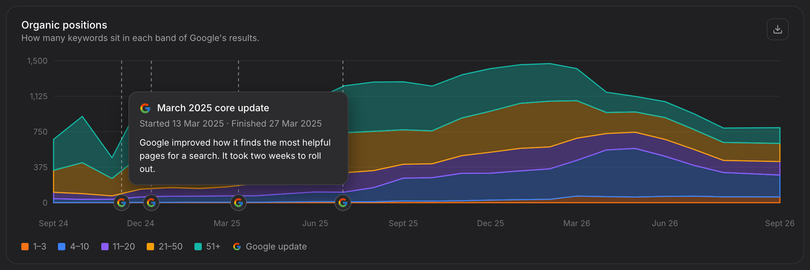

# Knowledge, News and the weekly digest — three agents and one outbox

**Started 2026-09-30. Status: building — phases 1, 2 and 3 built on dev
2026-10-01 ("can we build this out please"), with the revision below.** The decisions below
are Anthony's, in his words where he gave them; his answers to the first
thirteen questions are under "Answered". Change a decision here, with a date,
before building anything that disagrees with it. The questions still open are
at the end, each with the phase that needs it.

Overall: 29% (5 of 17.5 days, plus a day for the revision below). Phases 1–3
— Knowledge, Ask Hakken reading it, and News — built; phases 4–10 not
started.

## Revised — Anthony, 2026-10-01

Given on the Knowledge editor as first built, and confirmed ("Yes, rebuild
it") before the rebuild. These win over anything below that disagrees.

| # | Decision |
|---|---|
| R1 | **An editor is a page, never a pop-up.** A pop-up is for a yes or a no — confirming a delete — and nothing with fields. Every Admin → Content editor (an article, a Google update, a source, a recommendation) opens on its own page from its list (`ContentEditPage`, `useContentForm`). |
| R2 | **People write in English only; the machine translates into every other language** Hakken is read in — 10 to 15 are planned, not just English and Italian. No field per language, and publishing never waits for a person to write each one. This replaces A7 for everything written in Admin or collected: Knowledge, Google updates, "Who to follow", News items and, in phase 9, the digest. |
| R3 | **The Translator** (`CONTENT_TRANSLATOR`) is a seeded agent, as the wiki staff are: on the Agents screen, switchable off, its model calls in the cost ledger, its Run button translating whatever is missing. Each save that changes the English asks it at once; each translation keeps a fingerprint of the English it came from, and a reader sees their language only while it matches — the English otherwise, never a half-translated change (`contentTranslation.ts`, `contentTranslationActions.ts`). The languages are one list, `convex/utils/contentLanguages.ts`, held to the wording files by a test. |

### Built so far

- **Phase 1, Knowledge (2026-10-01).** `knowledgeArticles`
  (`convex/knowledgeArticlesSchema.ts`, `convex/knowledgeArticles.ts`): an
  article's title and body in English and Italian, draft or published, written
  only by the super admin and read by any signed-in user (`tenantQuery`), a
  draft reading as not there. Publishing needs both languages whole. The
  screens are `/app/knowledge` and `/app/knowledge/[articleId]` (the reader's
  language, English where the Italian is missing) and Admin → Content →
  Knowledge (`/admin/content/knowledge`). The traffic article ships through
  the `2026-10-01-knowledge-traffic-article` migration
  (`convex/knowledgeArticleSeeds.ts`), added once and never over an edit; it
  ran on dev the same day. Its text was written from the outline below —
  yesterday's chat draft was not kept — and is Anthony's to change in Admin.
  - Named "knowledge articles" in the code because "knowledge" is already the
    company knowledge-documents feature (`convex/knowledge.ts`).
  - An article's own table is styled by its screen
    (`[&_table]` on the article), since the kit forbids a hand-written
    `<table>` and the chat renderer stays as it is.
- **The revision (2026-10-01).** Every Content editor became a page (R1);
  Knowledge's Italian fields went, cleared on dev by a one-off migration
  before they left the schema (R2); the Translator was added (R3). A real
  translation on dev reached Google and was refused: the default fast model
  dev has chosen is one Vertex does not offer the project in `us-central1` —
  the model setting in Admin → AI, for Anthony at the end with the other
  configuration.
- **Phase 2, Ask Hakken reads published articles (2026-10-01).** Each write
  brings the shared brain in line (`convex/knowledgeArticleWiki.ts`): a
  published article is a global PRODUCT page, subject `knowledge-<id>`, in
  English (the brain's language; Ask Hakken answers in the reader's), which
  every company's Ask Hakken already reads; a draft or a deleted article's
  page is removed with its history. The page carries `knowledgeArticleId`
  (`wikiPages`): `applyRewriteInternal` refuses any staff rewrite of it with
  a `WIKI_PAGE_REFUSED` trace, the Tidier and the Linker leave it out, and
  the Platform Wiki screen's edit, pin and delete refuse it, pointing to
  Admin → Content → Knowledge (`convex/utils/knowledgePageGuard.ts`). A wiki
  page holds 4,000 characters, so a longer article is read only that far.
  `2026-10-01-knowledge-articles-to-wiki` copied the traffic article across
  on dev.
- **Phase 3, News (2026-10-01).** News on the main menu after Knowledge
  (`/app/news`): every item newest first, filtered by kind, each with its
  kind, source and date, a plain summary, "what this means for you" where
  there is one, and the way to the original; "Who to follow" beside it.
  Admin → Content gains News (take an item down; `newsTakenDown` keeps it
  from being collected again), News sources, Google updates and Who to
  follow, each listed with its editing page. A Google update is a News item
  at once, kept in step with it and read through the update's own
  translation; `listGoogleUpdatesBetween` is ready for the chart markers
  (phase 10). Tables: `convex/newsSchema.ts`, gathered with Knowledge's and
  the translations' in `convex/contentSchema.ts` so `schema.ts` stays inside
  its size band.

## What was asked

Anthony, 2026-09-30, after "Traffic 0" on page-one keywords turned out to be
DataForSEO's honest estimate under a map box, not a bug (the "<1" display
fix and the keyword-only / page-only searches were built on dev the same day):

- "i think we need to add a new section called information … a table with a
  list of FAQs which are clickable to a new screen with the detail. I want our
  first one to be about the traffic numbers … and reference that article …
  this is customer facing so the copy cannot be complex."
- Then: "Can you make a new nav item on the main left hand nav. i want to use
  this information as general knowledge — we can tag this as content for the
  sites menu. Ultimately this information will be available in ask Hakken too,
  to every company and login."
- "i also want to add a news section where we monitor Twitter accounts and web
  pages for updates, this could be around the release of google core updates,
  or people we recommend to follow, or youtube channels etc."
- "for news collection i want to create a new agent in the agents section for
  this so we can give it a role"
- "for core updates im happy to add these manually in the admin section"
- "we can then plan a weekly digest email from the platform which will be
  delivered to all registered users via resend — once a week through another
  agent"
- "I think we need to build a message queue service that a send agent reads
  from and sends and the weekly email agent only adds to that queue"
- "i agree but i want them as agents that i can assign a role to, so we can add
  it to the agent scheduler, the agents should be hooked up to logs, costs and
  observability too" — of the Sender being a plain worker with no AI.
- "Twitter i know is expensive and i will create a twitter API token … i also
  want the ability to bookmark the important ones on twitter and this reads my
  bookmarks for new bookmarks and imports those too"
- "when we add to the queue we need to give it a message type — in this
  instance it will be 'Weekly News Digest' — this way the agents that send the
  emails will know what template to use"
- "add to plan how many days each phase is and let me know the total too"

## Decided — Anthony, 2026-09-30

| # | Decision |
|---|---|
| D1 | **Knowledge** is a new item on the **main** left-hand menu. General knowledge, the same for every company. |
| D2 | The first article is how traffic is worked out, citing the Advanced Web Ranking click study. Customer-facing copy: short, plain, no jargon. Knowledge shows **only in its own place, never in Sites** (A8, which replaces "we can tag this as content for the sites menu"). |
| D3 | Knowledge is readable by **Ask Hakken** for every company and login. |
| D4 | **News** is a new section: updates from X accounts, websites and YouTube channels, Google core updates, and people we recommend following. |
| D5 | News is collected by a **new agent in the Agents section with its own role**. |
| D6 | **Google updates are entered by hand** in Admin and appear in News. |
| D7 | A **weekly digest email** goes to all registered users, through Resend, built by **another agent**. |
| D8 | A **message queue (outbox)**: the Weekly Digest agent only adds to it; a **Sender agent** reads it and sends. |
| D9 | Every queued message carries a **message type** — the first is **"Weekly News Digest"** — and the Sender picks the email template by it. |
| D10 | All three are **real agents**: a role you can assign, runnable from the agent scheduler (Admin → Schedules), and hooked into runs, logs, costs and observability. The Sender makes **no model call** (agreed: "i agree"). |
| D11 | **X**: Anthony creates the X API access. The collector watches chosen accounts **and reads Anthony's own X bookmarks**, importing each new one. |
| D12 | The plan gives **days per phase and a total**. |

## Answered — Anthony, 2026-09-30 (second round)

| # | Asked | Answer |
|---|---|---|
| A1 | Menu names and place | Knowledge and News, **after Search Console**. |
| A2 | Who sees them | **Signed-in users only**, and "i need to configure this in the admin section" — meaning the content is managed in Admin (A14). |
| A3 | Where in Admin | A **new "Content" group**. |
| A4 | Publish News straight away, or after a tick? | **Straight away.** |
| A5 | The digest on by default? | **Every user gets it**; each can subscribe and unsubscribe **from their own profile**. |
| A6 | When it sends | Anthony sets it **in the agent scheduler** (Admin → Schedules). No time is fixed in code. |
| A7 | English or Italian | **Both.** |
| A8 | How Knowledge shows in Sites | "this won't appear in sites just in this location" — **not in Sites at all**. |
| A9 | Google update chart markers | Not understood at first; explained with a picture and answered in A15. |
| A10 | X | **Add, edit and delete screens in Admin** for X accounts, YouTube channels, websites and the rest. |
| A11 | The digest's sender address | **An environment variable.** |
| A12 | Sender costs | "don't worry about sender costs": the Sender's runs record no cost. |
| A13 | Add to PRODUCT.md | **Yes**: added to Part Three §31 as unbuilt, with a change-log line, 2026-09-30. |

## Answered — Anthony, 2026-09-30 (third round)

| # | Asked | Answer |
|---|---|---|
| A14 | Who sees Knowledge and News: by role, by company, or both? | "this is a user frontend thing so its any logged in user on the front end, we manage it in the admin" — **every signed-in user sees both**; what "configure in admin" meant is managing the content. No visibility setting. |
| A15 | Google update markers on the Sites charts | Explained with a picture, then: "yes every chart please" — "every chart type that carries a date, not every chart"; "the google logo small on the line of the x axis"; "when you hover over the google logo it also gives you the title and description i set in the admin section for the google updates". Drawn 2026-09-30 on the Keywords page with ronins.co.uk's real two years and Google's real past core updates. |
| A16 | The digest's language | **The last language the user used** in Hakken. |
| A17 | X plan and accounts | Accounts, YouTube channels and websites are **managed in Admin with add, edit and delete screens**; the X plan is Anthony's choice when he creates the access. |

## How it will work — one week, end to end

1. **When the schedule Anthony set fires**, the **Weekly Digest agent** reads
   the week's News, any Google update and new Knowledge articles, writes the
   week's issue once, in English and Italian, and adds one outbox row per user
   still subscribed: type **Weekly News Digest**, the user, the issue. It
   sends nothing. Then it starts the Sender, the way the DataForSEO Planner
   starts the Collector today (`seoAgentRuns.startCollector`).
2. **The Sender agent** claims a batch of rows, renders each with the template
   its type names, in the user's language, sends it through Resend, and records
   the receipt. It paces itself under Resend's rate limit, and retries a failure
   up to three times. It also runs on its own schedule, to pick up anything left
   waiting.
3. **All week**, the **News Collector agent** runs on its schedule. It reads
   each source that is on — a website, a YouTube channel, a watched X account,
   Anthony's X bookmarks — saves anything new, and writes a one-line plain
   summary and "what this means for you", in English and Italian. The item is
   live in News at once, with its link to the original.
4. **When Google announces a core update**, Anthony adds it in Admin →
   Content: title, description, started, finished, link. It shows in News at
   once, and as a marker on every Sites chart that runs over dates.
5. **A customer** opens Knowledge from the main menu and reads "How is traffic
   worked out?", or asks Ask Hakken "why does my traffic say <1?" and gets the
   same answer.
6. **A user who wants no more digests** turns it off on their profile, or
   presses Unsubscribe in the email, which turns off the same setting.

Every agent run shows in the agent's Runs, Observability and Logs tabs, and the
two agents that use AI show their cost in AI → Costs, exactly as the DataForSEO
agents do today.

## What already exists, and is reused

Read from the code on 2026-09-30. Line numbers drift; search the names.

- **Agent roles.** An agent's role is `agents.systemKey`
  (`convex/schema.ts`, indexed `by_system_key`). Assignable roles are listed
  in `convex/utils/agentRoles.ts` (`ASSIGNABLE_AGENT_ROLES`: today the
  DataForSEO Planner and Collector). `convex/agentRoles.ts` `applyAgentRole`
  keeps one agent per role and writes an audit row. The Role dropdown is the
  Role card in `admin/agents/_components/AgentFormSections.tsx`, labels under
  `sections.role.*` in both message files.
- **Runs with no model.** `convex/agentRunStartService.ts` `startAgentRun` is
  the one place a run is dispatched by role, from the Run button, the schedule
  dispatcher and `startCollector`. The DataForSEO Collector runs plain code
  ("Neither calls a model", `convex/seoAgentRuns.ts`) and still writes steps,
  logs and costs. That is the precedent for the Sender.
- **Steps, logs and costs.** `agentRuns` (status, `costUsd`, tokens),
  `agentRunSteps` (the Observability timeline), `agentLogs`, and
  `agentTransactions` (the ledger every cost screen reads).
  `seoCollectionQueue.recordCollectorCall` shows all four being written for a
  paid call. `convex/agentRunStepWriter.ts` `appendRunStep` writes a step from
  plain code.
- **The per-run spend limit** is the agent's own `maxCostUsd`, checked against
  `run.costUsd` before each paid batch (`runHasSpentItsLimit`,
  `affordableRows`). No other budgets: the agent's own limit is the budget.
- **AI calls outside the agent loop.** The wiki staff call models directly
  (`generateTextWithResolvedModel` with `resolveModelConfigForExecution`) and
  record them in `agentTransactions` and `agentLogs`, but do **not** add to
  `run.costUsd`, so their per-run limit cannot bite. The News Collector and
  Digest agent must add to `run.costUsd` too.
- **The scheduler.** `schedules` with `agentId` and no `companyId`, interval
  JSON v2 (hourly, daily, weekly, fortnightly, monthly, set times, a
  timezone). The minute-by-minute dispatcher is `workflowEngine.scheduleDispatcher`.
  Screens: Admin → Agents → Schedules.
- **Email.** `convex/resendEmailService.ts` `sendResendEmail` (takes an
  idempotency key; retries three times). The branded shell is
  `convex/emailLayoutService.ts` `renderEmail(content)` (callers pass content,
  never markup; **at most 8 cards**, then an overflow link). The sender address
  comes from `emailBrandingService.ts`. `emailTemplates` holds editable copy
  for the invite only. Every email follows
  [the email design system plan](./email-design-system-plan.md), which wins on
  how mail looks.
- **The queue pattern.** `seoDataPulls` with `claimSeoBatch`,
  `releaseSeoBatch`, `markSeoPosting` (`postedAt` set just before sending, so
  a row is never sent twice), `reclaimStuckClaims` (10-minute claims). The
  outbox copies it.
- **The shared brain.** Global wiki pages (`wikiPages` with no `companyId`)
  are already read by every company's Ask Hakken
  (`wikiActions.selectWikiContextForQuery`; company pages win on the same
  subject, [two brains](./two-brains-architecture.md)). The wiki staff agents
  rewrite pages, so a human article needs protecting from them.
- **The main menu** is hand-written in
  `src/ui/components/layout/SidebarNavTrees.tsx` (`UserNavTree`), with the
  active-item map in `SidebarNavigation.tsx`, and frozen by
  `SidebarNavigation.characterisation.test.tsx` snapshots. Today for a user:
  Dashboard, Ask Hakken, Tasks, Calls, Sites, Search Console, Reception.
  Knowledge and News go after Search Console.

**What does not exist:** an outbox or sent-email log; any per-user email
setting, unsubscribe, or language preference (language is a browser cookie
only); any Resend webhook for bounces and complaints; any RSS, YouTube or X
reader; any article type for customers; any record of the language a user
last used (it lives only in their browser).

## The parts

### Knowledge

- **Main menu item "Knowledge"**, after Search Console, for every signed-in
  user (A14). Opens a list: title and description, a search box, and
  a table of articles. Clicking one opens it on its own screen with a back row —
  a screen, never a pop-up, as in Sites.
- **Admin → Content → Knowledge**: a table of articles with add, edit and
  delete (pencil and trash icons, each with a tooltip), each opening on its
  own page (R1). An article has a title and a body (plain text with simple
  formatting), in English, translated by the Translator (R2), and draft or
  published.
- **The first article** is the traffic answer drafted in chat on 2026-09-30:
  estimate not count; searches × who clicks; position matters; maps, AI
  answers and adverts take clicks; "about 1 in 5 / 1 in 10 / 1 in 85" for the
  first result with nothing / an AI answer / a map above it; what "<1" means;
  source [Advanced Web Ranking, July 2026](https://www.advancedwebranking.com/seo/organic-ctr)
  (US searches). It does not name DataForSEO.
- **Ask Hakken reads published articles.** On publish, the article is written
  to the shared brain as a global page marked as written by a person, which
  the wiki staff never rewrite, merge or retire. Unpublishing or deleting
  removes it.

### News

- **Main menu item "News"**, after Knowledge, for every signed-in user: a list, newest first, each item with its date, source,
  summary, "what this means for you" and a link to the original. Filters by
  kind: Google updates, X, YouTube, websites.
- **Admin → Content → News sources**: add, edit and delete X accounts, YouTube
  channels and websites; each with a name, its address or handle, and on/off.
  The list shows when each was last checked and its last new item. Connecting
  Anthony's X account for bookmarks is on the same screen.
- **Admin → Content → Google updates**: add, edit and delete. Title, description
  in plain words, started, finished (blank while rolling out), Google's link.

### Google updates on the Sites charts

- **Every Sites chart that runs over dates** shows each Google update inside
  its dates (A15); a chart that does not carry dates shows none.
- **The marker**: a thin dashed upright line on the day the update started,
  and a **small Google logo on the x-axis line** at its foot.
- **Hovering the logo** shows the update's title, its started and finished
  dates, and the description entered in Admin.
- **The chart's legend** gains "Google update" with the logo.
- **Approved 2026-09-30**: "these look great … ensure we don't get drift as i
  love this look". The look below is binding; change it here, with a date,
  before any code draws it differently.

#### The approved look — build exactly this

Drawn on the Keywords page's Organic positions chart, Last 2 years, with
ronins.co.uk's real bands and four real past core updates (November 2024,
December 2024, March 2025, June 2025) with example descriptions.

| Part | Exactly |
|---|---|
| Which charts | Every Sites chart whose x-axis is dates: today `SiteLineChart`, `SiteStackedAreaChart`, `SiteBarChart` and `SiteGainLossChart` wherever they plot days, weeks or months. Never `SiteScatterChart`, `SiteTreemap`, or a chart whose x-axis is not time. |
| Which updates | Each Google update whose **start date** falls inside the chart's dates. |
| Where along the axis | At the start date's true place in time, between the two plotted points either side of it — a monthly chart puts 13 March about two-fifths of the way from March to April, never on a point. |
| The line | Upright, from the top of the plot to the x-axis line; 1px; dashed 4 on, 4 off; the foreground colour at 55%. Drawn above the chart's areas, lines and bars. |
| The logo | Google's four-colour "G", **14px**, centred on a **22px** circle filled with the card colour and edged 1px in white at 20%, the circle's centre **on the x-axis line** at the foot of the dashed line. Month labels stay below it, clear of the circle. |
| Two close together | Logos never overlap. When two would sit closer than 24px, the later logo moves right to 24px from the earlier; each line stays at its true date. |
| The hover card | Shown while the pointer is on the logo (a tap on a phone). **300px** wide, card colour, 1px `border-dim` edge, 12px corners, the kit's popover shadow; 12px by 14px padding. Sits above the logo, kept inside the chart's edges. |
| The card's contents, in order | 1. The 16px "G" and the **title**, 13px, medium weight. 2. **"Started 13 Mar 2025 · Finished 27 Mar 2025"**, 12px, secondary colour; "· Still rolling out" when no finish date is set. 3. The **description**, 12px, foreground colour, as entered in Admin. Nothing else. |
| The key | The chart's legend ends with a **12px "G" and "Google update"**, after the chart's own series. Shown only when at least one marker is on the chart. |
| Colours | Theme tokens everywhere, except the logo's own four colours, which live in one file (below). |

#### Keeping it from drifting

- **One part draws every marker**: `GoogleUpdateMarkers`, beside the Sites
  chart parts in `src/app/(dashboard)/app/sites/_components/`, with the logo in
  one `GoogleMark` part — the only place Google's four colours are written,
  listed as a sanctioned exception beside `chartPalette.ts`. No chart draws its
  own marker, line, logo or card.
- **Built into the dated chart parts, not added page by page**: each dated
  chart part reads the Google updates itself and draws `GoogleUpdateMarkers`,
  so a new Sites page that uses a dated chart gets markers without doing
  anything, and cannot forget them.
- **A drift test**, `src/google-update-markers-drift.test.ts`, fails when:
  a Sites page draws a dated chart with Recharts directly instead of through
  the Sites chart parts; a dated chart part stops drawing
  `GoogleUpdateMarkers`; or Google's colours, the dashed line or the hover
  card are written anywhere but their one part.
- **A look test** on `GoogleUpdateMarkers` holds every number in the table
  above — 1px dashed 4/4 at 55%, the 14px logo on the 22px circle centred on
  the axis, 24px apart when close, the 300px card and its three lines in
  order, "Still rolling out" — so changing any of them fails a test and means
  changing this plan first.
- **Written into `docs/developer/screen-kit.md`** under a "Google update
  markers" heading when built, pointing back to this section and the picture.
- **Admin → Content → News**: every item collected, with delete, for the rare
  item that should not be there. Items go live straight away (A4); this is the
  way to take one down. (Added by this plan; not asked for — say if unwanted.)
- **"Who to follow"**: a written list of people and channels Anthony
  recommends, shown on the News page, edited in Admin → Content. It needs no
  monitoring.

### Who can see Knowledge and News

Every signed-in user of the app, whatever their role or company (A14); never
the public website. There is no setting for it: Admin → Content is where the
content is managed, not who reads it.

### The three agents

Each is created from its own template in Admin → Agents, then given its role in
the Role card. Each is runnable from the Run button and from Admin → Schedules,
where Anthony sets when it runs. Each writes steps and logs like the DataForSEO
agents; the two that use AI record their cost.

| Role | What it does | Calls a model? | When it runs |
|---|---|---|---|
| `NEWS_COLLECTOR` — News Collector | Reads every source that is on, saves what is new, writes summaries in English and Italian | Yes, for summaries (cost on the run) | Its schedule; every 6 hours suggested |
| `WEEKLY_DIGEST` — Weekly Digest | Writes the week's issue once, in English and Italian; adds one outbox row per subscribed user; starts the Sender | Yes, for the issue's short opening (cost on the run) | Its schedule, set by Anthony (A6) |
| `EMAIL_SENDER` — Email Sender | Claims outbox rows, renders by message type and language, sends through Resend, records receipts | **No**; records no cost (A12) | Started by the Digest agent, and hourly for anything left waiting |

- **A test mode for the Digest agent**, like the Planner's TEST/LIVE: in TEST
  the issue goes only to super admins, so it is seen before any customer gets it.
- **One run at a time** per role, as the Collector's `takeCollectorTurn`.
- **A stalled run is closed** after a set time, as `closeStalledRuns` does for
  the DataForSEO agents, so a crash never leaves a run "Running" for ever.
- **Costs.** Model calls and X reads add to `run.costUsd` and `agentTransactions`,
  so the agent's own spend limit stops a run. The Sender records none.

### The outbox and message types

One row per email:

| Field | Meaning |
|---|---|
| `messageType` | `WEEKLY_NEWS_DIGEST` ("Weekly News Digest") to start. The Sender's template is chosen by it. |
| `userId`, `email`, `language` | Who it is for; the address and language as they were when queued. |
| `payload` | What the template needs. For the digest, just the issue's id and the user's name; the issue is stored once, not copied into every row. |
| `status` | waiting → claimed → sent, failed, or skipped (unsubscribed since, bounced address, no longer a user). |
| `dueAt`, `claimedBy`, `claimedAt`, `postedAt`, `attempts` | The claim-before-send pattern copied from `seoDataPulls`. |
| `idempotencyKey` | Type, week and user (`WEEKLY_NEWS_DIGEST:2026-W41:<userId>`), also sent to Resend, so no one gets the same issue twice however often something retries. |
| `queuedByRunId`, `sentByRunId` | The Digest run that queued it; the Sender run that sent it. Both open in Observability. |
| `resendId`, `error`, `sentAt` | Resend's receipt, or why it failed. |

- **Templates by type.** A code map from message type to a function that turns
  the payload into `renderEmail` content, in English or Italian, with any words
  Anthony may want to edit (subject, opening line, button text) kept in
  `emailTemplates` under the type's name. Every later email type is one more
  entry.
- **Admin → Content → Outbox**: waiting, sent, failed and skipped, filtered by
  type and date, each row opening its email and its runs.
- **The digest's sender address** is an environment variable,
  `NEWS_DIGEST_FROM_EMAIL` (A11), set beside `RESEND_API_KEY`. Until it is set,
  the Sender refuses to send the digest and says why on the run, rather than
  sending from the unconfigured fallback address.

### Subscribing, language, unsubscribe and bounces — before any customer email

- **Every user is subscribed** to the Weekly News Digest (A5). **On their own
  profile** they can unsubscribe and subscribe again.
- **Their language**: the last language they used in Hakken (A16). Today that
  lives only in the browser, so the app records it on the user whenever they
  sign in or switch language; the digest reads it. English if never recorded.
- **A one-click Unsubscribe link** in every digest, and the `List-Unsubscribe`
  headers Gmail and Yahoo require of anyone sending in bulk; it turns off the
  same profile setting. `sendResendEmail` gains custom headers.
- **A Resend webhook** (a new route in `convex/http.ts`, its signature checked)
  that records bounces and complaints. The Sender skips a bounced or complaining
  address from then on.

### X

- **Watched accounts**: read with the access Anthony creates (an app token),
  added, edited and deleted on the News sources screen.
- **Anthony's bookmarks**: X gives bookmarks only to a personal sign-in, not an
  app token. Anthony connects his X account once on the News sources screen and
  approves "read bookmarks"; Hakken keeps the renewable access in the backend,
  never on a screen. Each run imports the bookmarks it has not seen.
- **Which X plan** is Anthony's choice when he creates the access (A17); it
  must include bookmarks. The price per read is entered once, so each
  run's X cost shows on the run.

## Limits — every one, named

Each is a proposed starting value; none is left unsaid in the code. Say which
should be a setting in Admin → Limits, and which a constant.

| Limit | Proposed | Where it bites |
|---|---|---|
| Items read per source per run | 50 | A source with more new items since the last run waits for the next. |
| X bookmarks read per run | 100 | The rest are read the next run. |
| Items in one digest email | **8** — `renderEmail`'s card limit | The rest behind "See all on Hakken". |
| Outbox rows claimed per batch | 50 | A bigger send takes more batches. |
| Send pace | Under Resend's rate limit (about 2 a second on the default plan; confirmed on the real plan) | 1,000 users take about 10 minutes. |
| Tries per email | 3, then failed | Shown on the Outbox screen. |
| Claim timeout | 10 minutes | A claim older than this is returned or failed, never sent twice. |
| Stalled run | 20 minutes, like the DataForSEO agents | Closed as failed. |
| Spend per run | The agent's own `maxCostUsd` | The run stops, marked capped. |

## Phases — with days

Days are building and checking days for the agent doing the work: code, tests,
the full local check, and a drawing where a screen is new. They do not include
Anthony's review time, or waiting on outside parties: the X developer account
and plan, and verifying the sending domain in Resend.

| Phase | What | Days | Needs |
|---|---|---|---|
| 1 | **Knowledge**: the main menu item after Search Console, for every signed-in user; list and article screens; the Content group in Admin with the Knowledge screen (add, edit, delete); the traffic article in English and Italian | 2 | — |
| 2 | **Ask Hakken reads published articles**, protected from the wiki staff | 1 | 1 |
| 3 | **News**: the News page; Admin → Content screens for News sources, Google updates, News items and "Who to follow", each with add, edit and delete | 2 | 1 |
| 4 | **Agent groundwork**: the three roles and templates; dispatch by role (today every assignable role goes to the DataForSEO action); cost on the run for direct model calls; one-at-a-time and stalled-run closing for the new agents | 1 | — |
| 5 | **News Collector**: websites (feeds, else Firecrawl), YouTube channels, summaries in English and Italian, live at once | 2.5 | 3, 4 |
| 6 | **X**: watched accounts; Anthony's bookmarks through Connect X | 2 | 5, and Anthony's X access |
| 7 | **Outbox and Email Sender**: the table, message types and the template map, claim-before-send, pacing, receipts, the sender-address variable, the Outbox screen | 2 | 4 |
| 8 | **Subscribing and bounces**: subscribe/unsubscribe on each user's profile; recording the last language used; one-click unsubscribe and headers; the Resend webhook; skipping bad addresses | 2 | 7 |
| 9 | **Weekly Digest agent**: the issue in English and Italian, the "Weekly News Digest" template, test mode, starting the Sender | 2 | 5, 7, 8 |
| 10 | **Google updates on the Sites charts**: the approved look, built once into the dated chart parts; the drift test and look test; the screen-kit entry | 1 | 3 |
| | **Total** | **17.5 days** | |
| 11 (optional, later) | **"Your sites this week"** in each user's digest: their websites' biggest moves up and down | 1 | 9 |

With the optional phase 11, **18.5 days**.

Phases 1–3 and 10 stand on their own and are useful before any agent
exists: 6 days. Phases 4–9 are the agents and the email: 11.5 days. Nothing reaches a
customer's inbox before phase 8 is done.

## Open questions

None. Every question asked on 2026-09-30 is answered above, and the chart
markers' look is approved.

## Noticed in passing, not changed

- The Admin agents list tags every agent that has a role as "Wiki staff"
  (`admin/agents/page.tsx`), so the DataForSEO agents carry it too. Phase 4
  fixes it for the new roles.
- The manual Run button puts the impersonated company on a run
  (`ctx.companyId ?? user.companyId`), while the schedule dispatcher uses the
  creator's own company. Harmless for platform-wide agents, but worth a look.

## Not in scope

- Knowledge anywhere in Sites (A8).
- Companies adding their own News sources.
- Moving existing emails (invites, alerts) onto the outbox. The outbox is built
  so they can move later, one type at a time.
- Editing articles or News anywhere but Admin → Content.
- News read by Ask Hakken (Knowledge only, D3). It can follow later.
