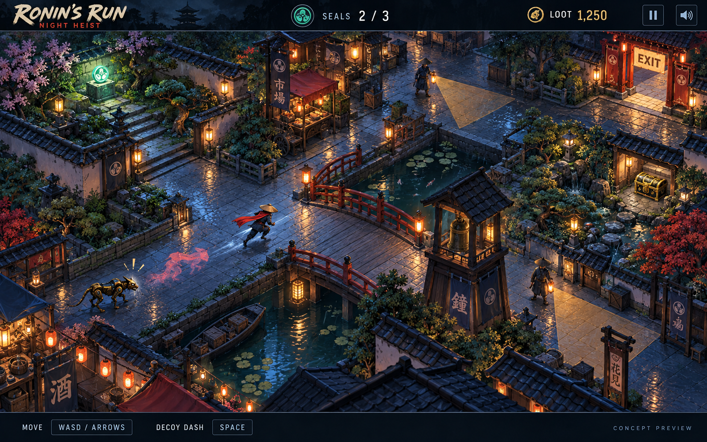

# Ronin's Run — Night Heist Plan

- Created: 2026-09-12.
- Last reviewed: 2026-09-12.
- Status: four-map local build and Spirit Power implemented and played; final balancing, art/audio polish and release validation remain open.
- Spirit Power slice: **100%** locally implemented and verified; final game-wide balancing and audio/art acceptance remain open.
- Opening-level balance and sound adjustments: **100%** implemented and locally verified; subjective difficulty and sound review remain part of final polish.
- Overall expanded game implementation: **93%** (estimate; acceptance below is authoritative).
- Four-map implementation/progression slice: **100%**. Saved escapes, unlocks, replay and final completion verified in Chrome and automated tests.
- Character-animation slice: **90%**; integration and verification overall **97%**. The replacement run/idle is implemented and inspected in Chrome; final movement feel remains under review. Production route validation remains blocked.

Read this document before changing Ronin's Run. It is the planning record for
the Night Heist redesign, alongside [AGENTS.md](../../../AGENTS.md).
The user subsequently said “let start the local app first and lets build this thing”.
That authorised the first courtyard build and normal local verification. The user
subsequently approved the four maps and instructed “add these to plan and build it”.
This authorises the four-map progression below, saved unlocks, original map assets
and local verification. The user then approved Spirit Power: “i love this idaea we should def build this”. Section 14 records that bounded addition. Production release and paid assets remain outside scope.

## 1. Purpose and decision status

Build towards a complete, original browser arcade game inside Hakken: an agile
ronin steals seals, misdirects patrols, and escapes four lantern-lit districts.
The approved build now spans four original, replayable heists. Preserve the
first level and the improved distance-driven running animation while expanding.

| Item | Status as of 2026-09-12 |
| --- | --- |
| Broad redesign of appearance, gameplay, characters, and sound | Open for exploration at the user's request. |
| No Pac-Man title, ghosts, or reused maps from that game | Explicit user constraints. Preserve them throughout design and implementation. |
| Night Heist concept image | Positively received by the user: “this looks amazing”. Preserve it as the visual reference. |
| A proper playable game | First courtyard runtime implemented locally; completion criteria below still apply. |
| A documented repository plan to avoid drift | Requested in this conversation; this document records the current direction. |
| Fixed angled camera with layered artwork, one courtyard, guards, hound, three seals, decoy dash | Basis of the first build after the user instructed us to start the app and build. |
| Engine, desktop controls, initial tuning and score rules | Working implementation choices in section 5; play balancing and release remain open. |

The user's originality constraints are design requirements, not a legal
clearance determination. Names, artwork, maps, animations, and audio must have
recorded origins; do not import another game's assets or layout.

## 2. Preserved visual reference



- File: [night-heist-concept-v1.png](../assets/ronins-run/night-heist-concept-v1.png).
- Generated with the built-in image generation tool on 2026-09-12 for this conversation.
- Source filename: `exec-7eccd479-4818-4379-9e05-7b8d003d2a1e.png`.
- SHA-256: `ee56ecab51efdddab18cef780f325553099d7acf1dc5bd82cb3c94dc1bc56d52`.
- This is a concept illustration, not a screenshot of implemented gameplay or a production asset pack.
- Keep this file unchanged. Save revisions as new versions and record which version the user selects.

### What the visual direction means

| Surface | Reference to preserve | How to assess it in the game |
| --- | --- | --- |
| Camera and world | Fixed, elevated, angled view; broad connected paths and believable courtyards. | Player position, reachable routes, and cover remain legible while moving. |
| Mood | Rainy night, cool slate and indigo, warm amber lanterns, restrained jade objectives. | Actual gameplay retains the warm/cool contrast without obscuring threats. |
| Hero | Compact masked ronin, straw hat, dark clothing, flowing red scarf. | Recognisable at play size, with consistent proportions and direction across animation frames. |
| Environment | Market stalls, low walls, garden, canal, bridge, optional treasure and an exit. | Scenery creates navigation choices; architecture does not accidentally hide the player. |
| Threats | Physical lantern guards and a distinct mechanical hound. | Silhouettes and behaviour communicate different threats without relying on colour alone. |
| Presentation | Illustrated materials, layered depth, restrained HUD. | Character, scenery, effects and interface feel like one game at the actual browser viewport. |

The composition is guidance, not a requirement to reproduce every pixel or
use its geometry as a finished level. Design traversable paths deliberately.
The subtitle, exact HUD arrangement, and lettering in the illustration remain
working treatments. Live labels must be real, localised UI, not baked into art.

Do not silently reduce the intended art quality to generic coloured shapes,
stock cubes, or a different art style. Placeholders can prove movement and
rules, but must be labelled as placeholders and cannot pass visual acceptance.
If an art technique cannot reach the reference, show the actual limitation
and agree the adjustment before changing direction.

## 3. Historical baseline before the first build

Source reviewed on `dev` on 2026-09-12 before implementation. This table is historical; the current architecture is recorded in section 10 and the updated developer guide.

| Area | Existing implementation | Implication for this redesign |
| --- | --- | --- |
| Route and app integration | `src/app/(dashboard)/app/arcade/ronins-run/page.tsx`; authenticated app route, start/exit, fullscreen, score UI. | Useful integration points, with substantial game-facing changes expected. |
| Runtime | `RoninCanvas.tsx` and `engine/GameEngine.ts`; custom Canvas 2D loop with fixed simulation steps. | Reassess lifecycle and rendering for the new game; a dependency choice is not yet settled. |
| World and movement | `engine/MapData.ts` defines one 28 × 31 grid named `PACMAN_GRID`; `engine/Player.ts` draws a shuriken. | Replace the map and player design rather than treating them as the new game's specification. |
| Enemies | `engine/Enemy.ts`; four coloured ninjas sharing a chase routine and vulnerability states. | New detection, search and distraction behaviour are required. |
| Progression | Clear all pickups; three lives; repeat the grid, with shorter power duration on later levels. | Extraction, capture consequences and score rules must be designed explicitly. |
| Audio | `engine/AudioEngine.ts`; synthesised pickup/death/start sounds and drones. | New sound direction, controls and cleanup need work. |
| Scores | `convex/arcade.ts`, `arcadeScores`; route uses game key `ronin`. | Preserve existing scores; define separate identity for incompatible new scoring before integration. |
| Tests | Arcade page table tests and `convex/arcade.test.ts`. | Existing coverage does not establish new movement, detection, animation or game-loop correctness. |

See [Auxiliary App Experiences](../../developer/auxiliary-app-experiences.md)
for the existing implementation. Recheck tenant wrappers and score visibility
before reusing backend functions; neither the “Global Leaderboard” label nor
older prose is sufficient evidence of the intended access policy.

## 4. Approved four-map scope

The first-level loop below remains the foundation for all four maps. Tuning
numbers are working choices, not separately approved promises.

| Order | Map | Intended experience |
| --- | --- | --- |
| 1 | Lantern Courtyard | Existing courtyard: learn movement, sight lines and decoy dash. |
| 2 | Night Market | Branching cobbled streets between stalls, tighter guard patrols. |
| 3 | Canal Docks | Separate quays connected by bridges, with more mechanical hounds. |
| 4 | Fortress Gardens | A longer final route through fortress gardens and stronger patrol coverage. |

A saved escape unlocks the next map. Earlier maps remain replayable. Unlocks
and personal bests belong to the player in their active workspace and survive
reloads. Each map has its own leaderboard because route lengths differ. The
existing courtyard scores remain valid. Locked-map starts are rejected by the
server. A failed save keeps the result and retry available; advancement waits
for successful persistence. Finishing the fourth map completes the campaign.
Each environment must have distinct original artwork and matching authored
collision, objectives, patrol routes and foreground depth. No recoloured copies.

**Player experience:** enter the courtyard, locate and collect three seals,
avoid or misdirect patrols, choose whether to risk optional treasure, then
reach the unlocked exit. Aim for a short run of roughly two to three minutes;
validate that pacing through play rather than making it a forced timer now.

| Element | Shared foundation and map variation |
| --- | --- |
| World | Four original, hand-authored maps with distinct routes: courtyard, market, docks and fortress gardens. |
| Hero | One ronin with readable idle, run, dash, caught and escape feedback. |
| Input | Desktop keyboard first: WASD/arrows to move and Space for decoy dash. Mobile/gamepad support remains undecided. |
| Spirit Power | One separate blue flame per attempt. Ten seconds of contact takedowns; patrols flee and remain disabled when caught. Warning at three seconds. |
| Signature action | A short dash leaves a temporary decoy that distracts an eligible pursuer; uses visible cooldown feedback. Working targeting and timings are recorded in section 5. |
| Guards | Two patrol guards in the first three maps; three in Fortress Gardens. Visible sight cones, solid cover, patrol, suspicion, chase and search states. |
| Hound | One mechanical hound in courtyard, market and gardens; two in Canal Docks. Trail/distraction behaviour remains distinct from guards, with shared rules in section 5. |
| Objectives | Three one-time seal pickups; one optional Spirit Power flame; one optional treasure chest; an exit that clearly shows locked/unlocked state. |
| Completion | Collect all seals and reach the exit to win. Capture ends the run with a quick retry; failed runs do not save a score. |
| Presentation | Animated hero and enemies, lantern atmosphere, restrained rain, clear HUD, start instructions and results. |
| Sound | Footsteps, pickup, detection, dash and result cues, ambience and music responding to pursuit; visible mute/volume control. |
| Session controls | Start, pause/resume, retry, exit and fullscreen, plus clear loading and error states. |

Weapons, combat beyond the approved Spirit Power contact takedowns, procedural worlds, multiple playable characters, multiplayer, shops,
upgrade trees, daily challenges and public-site promotion remain outside scope.
The four-map campaign above is now approved; no additional campaign systems are implied.

## 5. Working implementation decisions

| Area | First local build | Still to settle through play/review |
| --- | --- | --- |
| Scope | Four sequential original maps; three seals, optional treasure and an exit per map. Capture ends the current run. | Per-map balance and final acceptance. |
| Renderer | Existing Canvas 2D platform, fixed 60 Hz simulation, separate renderer; generated environment plus transparent animated sprites and foreground masks. No new dependency. | Consistent animation/depth review and measured browser frame budget. |
| Input | Desktop Chrome, WASD/arrows, Space, Escape; click-to-move uses the same collision map. Fullscreen and volume controls. | Minimum viewport, other browsers, mobile/gamepad. |
| Movement | Free movement at 154 world pixels/s; actor radius 6. Dash 440 pixels/s for 0.22 s, with 6 s cooldown. Terrain blocks both. | Pacing and input feel, including the short safe dash window. |
| Decoy | Lasts 3.8 s, attracts nearby patrols within 330 pixels once per decoy, takes priority over trail/chase and prevents capture by a distracted enemy. | Feedback and difficulty tuning. |
| Threats | Guard cones: 205 pixels, 86.4 degrees total; hound senses within 135 pixels and follows nearby trail points aged 1.2–7 s. Walls block visibility and capture. | Guard/hound readability and fair reaction time at corners. |
| Results | Three seals plus exit wins. Failed runs do not save a score. Escape score: 4,500 + optional 750 treasure + max(0, 1,200 - 5 × whole seconds) - 50 × min(alarms, 20). | Score/pacing balance; no forced timer. The initial 2–3 minute aspiration is not yet demonstrated. |
| Persistence | Key `ronin-night-heist-v1`, active-workspace ranking, server start receipt, server score calculation, owner/company checks, idempotent finish, visible save retry. Old scores preserved. | Client claims are not authoritative anti-cheat; receipt retention and large-scale search/count design before broad launch. |
| Art/audio | Recorded generated asset origins; original procedural score and cues; no purchased assets. | Final edge/animation polish and auditory review. |

These choices implement the agreed direction and can be tuned within it. A material
change to camera, core loop, audience, first-level scope or release still requires
alignment; routine implementation fixes do not create repeated approval steps.

## 6. Delivery sequence

| Phase | Deliverable | Evidence required to finish | Status |
| --- | --- | --- | --- |
| 0 — Direction and scope | Preserve this reference; agree the first level and relevant open decisions. | Recorded decisions and a bounded first-build scope. | Complete — reference preserved and user instructed the build; 100%. |
| 1 — Movement and rules | A clearly labelled prototype of the original level: movement, blocking, detection, decoy, objectives, win/failure and retry. | Repeatable complete runs; focused simulation tests; movement and threats make sense in the browser. | Full simulation and Chrome escapes pass; further threat-cue and corner-fairness review remains — 98%. |
| 2 — Art in motion | A representative courtyard section with the real hero, patrol, foreground/background layers, lantern light and rain. | Actual browser capture compared with the reference; consistent animation, depth and readability at play size. | Live Chrome scene compared with the preserved reference; hero run/idle rebuilt after glide feedback; final animation/depth acceptance remains — 90%. |
| 3 — Complete first level | Apply the proven art throughout the level; finish sound, feedback, controls and results. | Full start-to-result playthrough with no final-art placeholders; both win and capture/retry demonstrated. | Start, capture/retry, escape and saved result demonstrated; controls hardened; final play balancing remains — 85%. |
| 4 — Hakken integration and verification | Agreed score identity and visibility, locale parity, failure handling, focused checks and repository gates. | Recorded functional, visual and performance results; verified score isolation from the old game. | Saved browser score survives reload; two development frame samples recorded; full production validation still blocked by existing route exports — 97%. |

Phase 2 happens before producing a whole asset pack: prove that the visual
direction works with real animation and navigation while changes are still
manageable. Passing the rules prototype alone is not completion of the game.

The user approved phases 5–6 on 2026-09-12, expanding the previous one-level boundary.

| Phase | Deliverable | Evidence required to finish | Status |
| --- | --- | --- | --- |
| 5 — Four original maps | Three new painted environments; per-map navigation, objectives, patrols and depth; preserve v2 hero motion. | Reachability and full physical playthrough tests for every map; browser art/route inspection. | Implemented and verified locally — 100%. |
| 6 — Saved campaign | Map selection, locked/completed states, next-map flow, final completion and replay; workspace-owned progress and per-map scores. | Backend authorization/idempotency/legacy tests, UI save-retry tests and browser confirmation. | Implemented and verified locally — 100%. |

Committing, pushing and deploying follow the user's separate instructions and
the repository handoff rules.

## 7. Technical and asset boundaries

- Keep simulation state distinct from rendering and React page state. Routine UI updates, resizing and fullscreen changes must not restart a run.
- Give the level an explicit walkable/collision map, object placement, spawn locations, routes and depth information. Do not infer collision from image colours.
- Use repeatable fixtures or seeded randomness where needed to reproduce detection, distraction and collision issues.
- Source the environment as usable layers/objects and characters as consistent animation frames or another proven animation approach. The flattened concept image contains a hero, UI and effects; it is not a clean gameplay background.
- Record asset origin, generation brief or licence, selected version, dimensions, anchor points and animation timing as assets are introduced. Keep source references separate from runtime exports.
- Handle loading failures visibly. Stop listeners, simulation and audio when leaving the game. Pausing or hiding the tab must not cause an unseen loss or a large simulation catch-up.
- Keep routes and existing diagnostic-navigation behaviour within their current scope unless a change is agreed. Do not modify the frozen movement demo or its avatars for this game.
- Follow [Screen Kit](../../developer/screen-kit.md) for the surrounding app UI. Keep leaderboard paging at 15 and English/Italian dictionaries in parity. Avoid native browser dialogs.
- The illustrated world's colours do not justify hardcoded dashboard UI colours. Follow the [Theme Compliance Plan](./theme-compliance-plan.md); resolve any needed game-rendering palette convention explicitly without increasing existing drift allowlists.
- Preserve tenant isolation and prevent invalid/repeated score writes. Read the Convex skill before editing `convex/`; settle score audience and validation rather than inheriting assumptions from the current page.

## 8. Acceptance checklist

Agree material gameplay criteria before coding them. Once a slice is agreed,
record its evidence here; do not weaken criteria after a failure to claim completion.

### Four-map progression

- [x] Four distinct final-art maps match their walkable geometry and objective placement.
- [x] Every map has a complete traversable route with active patrols and ordinary controls.
- [x] Successful saved escapes unlock maps in sequence; reload and workspace isolation preserve correct progress.
- [x] Locked starts, cross-owner receipts, duplicate finishes and direct score bypass are rejected or safely idempotent.
- [x] Map-specific rankings preserve courtyard history; completed maps can be replayed.
- [x] Save failures cannot silently lose an escape or advance the campaign.
- [x] Fourth-map completion has a clear finished state and replay path.

### Gameplay and session behaviour

- [x] Player movement is responsive and cannot cross blocked terrain or escape the level.
- [x] Dash and decoy obey the agreed rules and cooldown; their effects are visible.
- [ ] Guards cannot see through walls; detection and loss of sight match visible cues.
- [x] Hound behaviour follows the agreed trail/decoy priority and can be reproduced in a test.
- [x] Each seal and treasure reward applies once; the exit unlocks only when requirements are satisfied.
- [x] Start, capture, escape, results and retry work, with exactly one terminal result per run.
- [ ] Pause/resume, focus loss, fullscreen and exit preserve or end the session as intended without duplicate loops or audio.
- [x] Score-save failure keeps the result visible and offers recovery without accidental double submission.

### Visual and audio quality

- [x] Real gameplay demonstrates the reference's hero, camera, illustrated world, lantern contrast and restrained HUD.
- [ ] Characters animate consistently in every supported direction; depth ordering and foreground visibility work along all playable routes.
- [ ] Paths, objectives and detection cues remain readable at the agreed minimum viewport.
- [ ] Music/effects follow game state, mute works, and essential information is available visually.
- [ ] Final level art contains no accidental duplicate heroes, baked-in HUD, stray generated text or placeholder graphics.
- [x] A real browser playthrough is reviewed alongside the reference. Another generated illustration is not implementation evidence.

### Reliability and integration

- [x] Focused tests cover collision, detection, decoys, one-time rewards, completion and score rules where implemented.
- [ ] Browser checks cover successful escape, capture/retry, pause/resume, exit/re-entry and a score failure.
- [ ] A representative session with rain, enemies, audio and repeated retries meets the agreed device/browser performance budgets; record device, viewport, duration and measured results.
- [x] New scores cannot mix with old `ronin` scores; agreed authentication, visibility and input validation are checked.
- [x] The app shell, locale parity, screen-kit and theme checks pass without expanding drift allowlists.

Before a merge/push recommendation, use Node `24.18.0`, run `npm ci` before
trusting local verification, and follow the gates in [AGENTS.md](../../../AGENTS.md):

```bash
npm run verify:env
npm run lint:all
npm run check
npm run build
git diff --check
```

Add the focused browser verification appropriate to this game. If the local
frontend is using port 3000, follow the handoff's stop/build/restart procedure.
Record failures plainly. Documentation checks do not count as game verification.

## 9. Change control and handoff

For each agreed slice, update this same plan with the decision, affected
surfaces, completed work, evidence, unresolved issues and next action. Report
overall game progress separately from current-slice progress. Percentages are
estimates, not proof, and documentation progress must not inflate implementation.

For a material change to the visual target, camera, core loop, approved four-map
scope, score rules or acceptance criteria, explain the proposed outcome and
tradeoff and obtain agreement before implementing the change. Keep the earlier
decision in the log. Do not silently substitute an easier game or expand the
scope beyond the four-map campaign now approved in section 4.

| Date | Decision or event | Evidence/status |
| --- | --- | --- |
| 2026-09-12 | User opened all aspects of the existing arcade game for redesign, subject to original name/characters/maps constraints. | Conversation; no product implementation authorised by brainstorming alone. |
| 2026-09-12 | Night Heist image generated and positively received. | Preserved image and checksum in section 2. |
| 2026-09-12 | One complete courtyard level proposed as the first build target. | Historical first milestone; subsequently built and expanded by explicit instruction. |
| 2026-09-12 | User approved the four proposed maps and instructed “add these to plan and build it”. | Expands the earlier one-level boundary to the campaign in section 4; production release remains separate. |
| 2026-09-12 | Repository plan and visual reference recorded to prevent drift. | Documentation only; game implementation remains 0%. |

Documentation verification on 2026-09-12: all 265 local file/image links across
the plan and three updated documents resolved; both indexes and the arcade
guide link this plan; the saved PNG is byte-identical to the original and its
checksum matches section 2. This verifies documentation integrity, not game behaviour.

## 10. First build handoff — 2026-09-12

The local app and development Convex watcher were started after the user's go.
The user signed into Chrome. The first playable Night Heist replaces the old
runtime on `/app/arcade/ronins-run`; it is not committed, pushed or deployed to production.
The existing configured development Convex deployment received the schema/functions
through its watcher. Local startup also required adding the missing Node-runtime
marker to `convex/utils/safeWorkflowHttp.ts`; its 17 focused tests pass.

### Delivered

- Separate simulation, navigation, renderer, audio and React session boundary.
- Clean illustrated courtyard, four-direction ronin, animated guards/hound, painted open/closed treasure, sight cones, seal runes, rain and foreground depth.
- Original ground polygons and patrol routes, connected objectives, dash/decoy, suspicion/chase/search and hound trails.
- Instructions, loading/error recovery, pause/resume, focus-loss pause, fullscreen, mute/volume, capture/retry, escape result and score-save recovery.
- English/Italian parity; shared screen kit, 15-row table; new scores scoped to the active company. Personal-data erasure includes the new run receipts.
- [Asset production record](../assets/ronins-run/asset-production.md) with hashes, generation briefs, frames, anchors and timing.

### Evidence and honest limits

- Focused rule tests cover blocked terrain, shared clearance, complete physical routes, one-time rewards, locked exit, decoy cooldown/priority, hound scent, pause/reset and singular terminal outcomes. A full run with all patrols active collects every seal and treasure and escapes using ordinary movement and timed decoys.
- Full-route testing exposed a bridge entrance snag and narrow-corner cutting. Navigation and motion now share clearance, traverse exact waypoints, and have regression coverage for the corrected bridge join.
- UI tests cover asynchronous start, stable engine ownership across parent updates, cleanup, asset-load retry and saving the same failed result again.
- Backend tests cover authentication, player/company ownership, new/old score isolation, server score calculation, invalid/expired receipts, idempotent finish and the start limit.
- Chrome inspected at a 1345 × 1107 viewport, including fullscreen: live illustrated scene, character/patrol movement, garden and market seal collection, capture/retry and pause/resume. These checks do **not** establish a successful browser escape, a saved browser result, exhaustive route occlusion, audio quality approval or a 60 FPS performance measurement.
- Four-frame locomotion is a first art pass. Additional idle/dash/terminal character animation and edge cleanup remain polish work.
- Search currently covers loaded leaderboard rows and count is capped at 10,000. Abandoned receipts have no scheduled expiry yet. The score checks prevent duplicate/invalid writes, not forged client gameplay.

### Final local verification record

- `npm ci` completed; `npm run verify:env` passed: Node 24.18.0 and all 57 direct dependency versions match the lockfile.
- `npm run check` passed: all source guards, lint, cold typecheck and **6,288 tests across 717 files**. This is the source/test gate run before production-generated route validation. One pre-existing lint warning remains at `src/ui/components/layout/Header.tsx:176`; frozen movement tests also emit existing mock-hoisting warnings.
- Focused game, score, privacy and related guard checks: **68 passed**. The final locale correction and UI boundary checks also pass.
- `npm run build` did not pass in this environment: first Google Fonts requests were blocked; the network-enabled retry reached a Turbopack worker-port `EPERM` error.
- `npm run build -- --webpack` successfully compiled the production bundle in 24.6 s, then failed production route validation on existing named helper exports in three unchanged routes: `admin/agents/[id]/observability/[runId]/page.tsx`, `admin/ai/tools/[id]/page.tsx`, and `demos/movement-capture/benchmark/device/page.tsx`. No check was disabled and no successful full production build is claimed. Those unrelated routes were inspected, not changed.
- **273** local document/image links resolved; `git diff --check` passed. Theme drift fell from 1,052 to 1,031; obsolete arcade screen/layer exceptions were removed.
- Both local services restarted successfully after the build checks. The development Convex watcher reports functions ready. No commit, push or production deployment was performed.

The next action at this handoff was a browser escape and saved leaderboard row;
that work is now recorded in section 11. The remaining acceptance boxes stay open
until their stated evidence exists.

## 11. Browser completion and control/performance slice — 2026-09-12

The user instructed us to continue the build. This slice preserves the first-level
scope and working score/patrol rules; no production release or additional level is implied.

### Browser evidence

- Completed a real Chrome run using canvas clicks and Space, responding to the
  visible warning and cooldown. Route: garden seal → eastern seal → treasure →
  market seal → eastern gate. Patrols remained active. Pauses between route legs
  allowed inspection; no browser state injection or simulation shortcuts were used.
- The result was **28 seconds of game time, three seals, treasure and 6,260 points**.
  The UI confirmed saving; the active workspace leaderboard showed one matching
  entry. It remained present after a page reload. Capture/retry in later runs did
  not add another score.
- The 28-second known-route escape is much shorter than the original two-to-three
  minute aspiration. It is not a first-time-player pacing study. Keep pacing open;
  do not add forced delay or silently rewrite the target to pass it.
- Compared the live fullscreen scene with the preserved concept: fixed angled
  courtyard, scarf-wearing hero, guard/hound silhouettes, warm lanterns, cool wet
  paving and separate HUD are represented. This does not close all-direction
  animation, all-route occlusion, minimum viewport or auditory review.

### Control fixes

- Leaving the canvas releases held movement keys and any queued dash. Pointer
  travel continues when using an in-game control; window focus loss still pauses.
- Start, pause, resume and reset clear queued input; paused input cannot trigger a
  dash on resume. Clock resets prevent background time becoming a movement jump.
- Secondary pointer buttons do not set a destination. Resume after a terminal
  result cannot restart music. Disposal is idempotent and pending artwork loading
  cannot install a loop after unmounting.
- Eight engine regression tests exercise real simulation with mocked rendering/audio
  boundaries. Three measurement tests cover stalls, invalid values and pause/reset.

### Baseline frame measurements

Added opt-in development profiling through `?gamePerformance=1`; see the
[developer guide](../../developer/auxiliary-app-experiences.md#development-performance-check).
It logs ten-second active windows and resets on pause/retry. It does not control
the player, alter patrols, submit scores or run in production.

Chrome on the user's local Mac, development server, fullscreen viewport
**1345 × 1107**, displayed canvas **1343 × 840**, backing canvas **2686 × 1680**.
Rain, guards, hound, audio and ordinary route movement were active. The second
sample followed capture/retry in the same page session.

| Sample | Active window | Frames / average FPS | Frame interval p95 | Engine work p95 / max | Frames over 34 ms | Time dropped by the 100 ms frame cap |
| --- | --- | --- | --- | --- | --- | --- |
| Garden and bridge, 08:05:22 UTC | 10,001.9 ms | 593 / 59.29 | 17.9 ms | 1.2 / 38.1 ms | 1 | 33.2 ms |
| Repeated route, 08:07:00 UTC | 10,008.0 ms | 594 / 59.35 | 18.1 ms | 1.4 / 36.1 ms | 1 | 16.6 ms |

These are two short baseline samples, not a cross-device performance sign-off.
RAF cadence includes page scheduling; engine work measures synchronous simulation,
audio dispatch and Canvas commands, not completed GPU paint. Each sample includes
one stall. The precise Mac model and Chrome version were not recorded, and a minimum
device/browser budget has not yet been agreed. The broad performance checkbox stays open.

### Current checks and next action

- `npm run verify:env` passed with the focused run: Node 24.18.0 and 57 locked direct dependencies.
- **42 focused tests across six files passed**, including the 11 new input/measurement tests.
- Source guards passed without adding drift exceptions.
- `npm run lint:all` passed with the existing `Header.tsx:176` hook-dependency warning; no lint errors.
- All **274** local links across the plan, asset record, developer guide and two indexes resolved. `git diff --check` passed.
- `npm run typecheck` still fails only on the same three existing route helper exports
  listed in section 10; the generated production validators are included. No check
  was removed and no fresh all-green source/build gate is claimed.
- Production build was not repeated because its known route errors are unchanged.

**Next action:** polish dash/capture/escape animation and review threat readability
and pacing with an unfamiliar player. Resolve the three unrelated route-export build
errors before release; complete the remaining browser failure/re-entry, audio and
viewport acceptance checks. Overall estimate **82%**; this control-and-performance
slice **100%**. No commit, push or production deployment.

## 12. Character glide repair — 2026-09-12

The user reported that the hero was gliding rather than running and asked for more
realistic movement. Inspection confirmed that the v1 frames repeated almost the
same leg silhouette. The renderer also fitted every pose to the same height and
anchored it at its lowest painted pixel, erasing vertical weight changes. Footsteps
ran on a separate 0.25-second timer.

Implemented within the current character/art direction:

- New run artwork with six selected contact/compression/flight poses per front/back
  view, mirrored for left travel, replacing the nearly static four-frame cycle.
- Separate planted standing artwork, fixed source scales and authored ground origins.
  Knee compression and airborne feet retain their original differences in height.
- A complete stride spans 88 travelled world pixels. Footsteps trigger on the
  corresponding 44-pixel contact boundaries; stopping returns to idle, blocked motion
  stays quiet, and dash holds an extended pose without sped-up running footsteps.
- New assets, hashes, exact generation prompts, selected indices and anchor conventions
  are in the [asset record](../assets/ronins-run/asset-production.md) and
  [prompt record](../assets/ronins-run/ronin-animation-v2-prompts.md). Only selected,
  genuinely transparent PNGs entered the runtime.

Verification:

- **47 focused tests across eight files pass**, including all existing route/win/score
  checks. New tests cover distinct phases/directions, distance-synchronised footsteps,
  stop/dash/blocked behaviour, constant rendering scale, authored vertical anchors,
  selected image bounds and actual RGBA image headers.
- Node 24.18.0 / 57 locked direct dependencies verified. Chrome reload loads the new
  assets without browser errors. Successive live screenshots show changing knee/foot
  positions on the garden route and return route; standing and decoy poses are visible.
- These observations establish the replacement in real gameplay, not final subjective
  animation acceptance. The six-phase sprite loop is not a skeletal animation system;
  smoother transitions and dedicated capture/escape animation remain open.
- The level, speed, collisions, patrol rules and score formula were not changed by this
  presentation repair. The full live-patrol simulation escape still passes.
- Source guards and lint pass, with the existing `Header.tsx:176` lint warning.
  Type checking reports only the same three unrelated production route-export errors;
  the new game code and tests introduce no remaining type errors. No full build rerun
  or passing production build is claimed.
- All **282** local links across the maintained game documents, prompt record and
  indexes resolve; `git diff --check` passes. Only the two selected v2 PNGs were added
  to runtime assets; the old sheet remains available for comparison.

**Next action:** review the updated movement feel in Chrome and refine any remaining
stiffness, then complete capture/escape animation and broader art acceptance. Overall
estimate **84%**, current animation slice **90%**. The existing production route-export
blockers remain tracked in section 10. No commit, push or production deployment.


## 13. Approved four-map build — 2026-09-12

The user approved Lantern Courtyard, Night Market, Canal Docks and Fortress Gardens,
then explicitly instructed us to add them to this plan and build them. This section
supersedes historical one-level-only scope statements. It does not approve a release.

### Implemented

- Three distinct original painted environments, with [exact prompts and provenance](../assets/ronins-run/four-map-environment-prompts.md). Existing courtyard and v2 hero sheets are preserved.
- Immutable level definitions own terrain, solid cover, spawn, seals, treasure, exit,
  explicit patrol kinds/routes and foreground layers. Movement, A*, visibility and
  renderer cones all receive the selected map. Navigation caches are isolated per map.
- Market offers branching routes around stalls. Docks has three usable bridges and
  two hounds; a live check found and fixed missing clearance at the western landing.
  Regression tests check local crossings of each bridge, not just global reachability.
  Fortress adds a third guard and garden loops.
- Four-map selector with locked/completed states and personal bests, localized in
  English and Italian. Map changes replace the engine while retaining fullscreen and
  sound preferences. Progress updates do not reset a run.
- Saved escapes unlock maps in order, scoped to the player and active workspace.
  Four indexed best-score reads derive progress directly from persisted scores.
  Existing courtyard escapes still count. Each map has its own leaderboard key.
- Server starts enforce all prerequisites and store the map on the receipt; finish
  derives the score key from that receipt. The whole Night Heist namespace rejects
  direct legacy score submission. Retries remain transactionally idempotent.
- Save rejection or a 15-second pending connection keeps the same result and exposes
  retry; advancement waits for acknowledgement. A late original write is safe because
  retry uses the same receipt. Final saved escape shows “The night is yours”.

### Browser evidence

Chrome, signed in to the development app in the Ronins Website - Knowledge workspace;
fullscreen viewport 1345 × 1107, canvas display 1343 × 840 and backing 2686 × 1680.
Native route clicks, Space decoys and the visible HUD were used. No teleporting,
injected progress, disabled patrols or debug score writes were used for browser runs.

| Map | Observed saved escape | Progress result |
| --- | --- | --- |
| Lantern Courtyard | Existing 6,260-point escape preserved | Market unlocked from the prior score. |
| Night Market | 28 seconds, three seals, treasure, 6,260 points | Continue loaded Canal Docks. |
| Canal Docks | 24 seconds, three seals, treasure, 6,330 points | Continue loaded Fortress Gardens. |
| Fortress Gardens | 23 seconds, three seals, treasure, 6,235 points | Saved completion screen and replay confirmed on a fresh load. |

The final map was replayed successfully: two separate 6,235-point rows are two real
runs, not a duplicated finish. Reload showed all four maps completed with correct
personal bests. Captures/retries, pause/resume, loading and fullscreen transitions
were also observed. One earlier final-save screen stayed on “Saving” during the
long development session; reload confirmed its score persisted. The new bounded
save-retry path is unit-tested, and a fresh-load replay showed successful saved
completion. The cause of that earlier delayed UI acknowledgement was not established.

### Verification and remaining work

- Full suite: **6,323 tests in 722 files passed**, before the final save-timeout addition
  (`/tmp/night-heist-maps-full-suite.log`). After that addition, **67 focused tests in
  nine files passed** (`/tmp/night-heist-maps-final-focused.log`).
- Tests cover all-map placements, collision-safe paths, physical traversal, live-patrol
  escapes, independent navigation caches, each dock bridge, locked starts, sequential
  unlocks, replay, idempotency, old scores, player/workspace isolation and failed or
  indefinitely pending save recovery. Theme and broad-read inventory tests pass.
- Development backend schema/functions pushed successfully by the existing watcher.
  The new index is `arcadeScores.by_user_company_game_score`; no new progress table.
- Guard checks and lint pass (lint retains the existing Header.tsx dependency warning).
  All 287 local links across seven maintained docs validate; `git diff --check` passes.
  A fresh Chrome session reports no browser errors and is left on the map selector.
  Final type checking reports only the same three unrelated route-export errors
  documented earlier. A production build/release is not claimed; no push or commit.
- Fast successful routes take 20–30 seconds. The original 2–3 minute pacing aspiration
  and a longer final-map run are **not demonstrated** by these samples. Final balance,
  corner/threat fairness, motion/audio polish and a minimum-device frame budget remain
  open; the four-map implementation being complete does not close those whole-game gates.

Handoff estimate: **88% overall; four-map implementation 100%**. Next work is play
balancing and final motion/audio acceptance, followed by release validation once the
existing route-export blockers are resolved under their appropriate scope.

## 14. Spirit Power — approved 2026-09-12

A separate blue flame lets the ronin turn the tables on guards and mechanical
hounds. Green seals retain their extraction role. The user explicitly approved
this addition after discussing why seals did not defeat enemies.

Working rules and acceptance:

- One optional blue flame on reachable ground in each of the four maps. It is
  visually distinct from the three green seals and activates on contact.
- Ten seconds of Spirit Power, frozen while paused. An aura, countdown and
  duration bar identify the active state. At three seconds, warning text, an
  amber aura and a sound cue warn the player to move clear. Expiry is explicit.
- Patrols flee during the power window. Touching a guard knocks them out;
  touching a mechanical hound disables it, including during a dash. Retreat
  base speeds are 92 pixels/s for guards and 106 for hounds, below the ronin’s 154.
  The courtyard now applies its 0.75 movement multiplier to these as well (section 15).
  Powered contact uses 26 pixels; ordinary capture remains 18. Walls
  still block contact. Pickup resolves before contact on the activation frame.
- Disabled patrols remain down for this attempt, with grounded sprites, sparks,
  impact sound and a local counter. They cannot see, chase or capture the ronin.
- The flame is single-use per attempt. Retry resets the flame, timer and patrols.
  Expiry restores danger from remaining patrols; it does not revive disabled ones.
- All three seals and the exit remain necessary. No knockout score bonus,
  backend schema change or new progression system is part of this slice.
- Verify pickup/expiry boundaries, both enemy types, one-time effects, pause,
  retry, wall blocking and all-map reachability with automated tests; inspect
  and play the real Chrome build, including warnings and contact takedowns.

The existing v2 run animation, painted maps and score persistence are preserved.
Flames, aura and sparks are original Canvas effects; no imported game art.
Local verification completed 2026-09-12:

- 14 dedicated Spirit Power tests cover all four pickup routes, contact before
  capture, guards and hounds, physical pursuits, one-time rewards, wall blocking,
  exact expiry, pause, terminal freeze and retry restoration. HUD and renderer
  tests cover warning/spent states and clear effects with reduced motion.
- All 6,340 tests across 723 files passed after mechanic tuning. The focused
  game and arcade tests also pass. Local environment, repository guards and
  lint pass (one pre-existing Header hook warning).
- In Chrome, the courtyard flame activated through normal movement; a hound
  was disabled at approximately 0:04 with seven seconds of power remaining.
  The counter stayed at one after expiry and the hound did not revive.
- A garden run reached the flame at approximately 0:03, then knocked out a
  guard on the central avenue. The grounded sprite, sparks, aura and counter
  were inspected. The amber three-second warning, spent state, pause/resume
  and reset on another attempt were also exercised. These checks used ordinary
  clicks/dashes, without browser state injection or disabled patrols.
- Fullscreen works in the user's original Chrome tab. The separate QA tab
  refused fullscreen, so it was tested in its normal viewport. Its informational
  fallback notice now allows clicks through it so map cards remain usable.
- Production validation still has the same three unrelated Next page-export
  type errors recorded above. No production deploy or push was performed.

The Spirit Power slice is complete locally. Final whole-game pacing, sound
listening and animation/art acceptance remain part of the existing polish work.

## 15. Gentler opening heist and louder sound — 2026-09-12

The user reported getting caught too easily in level one and that music/sound
was too quiet. This is a balance and mix adjustment within the existing game,
with no new lives, scoring contract or progression system.

Level one is an introduction. `Levels.ts` now owns optional `patrolTuning`;
other maps retain the standard profile. All patrol movement goes through its
speed multiplier, including patrol, chase, search, decoy, scent and powered retreat.

| Setting | Before | Courtyard now |
| --- | --- | --- |
| Ronin run speed | 154 pixels/s | 154 pixels/s |
| Guard chase | 139 pixels/s | 104.25 pixels/s |
| Hound chase | 167 pixels/s | 125.25 pixels/s |
| Patrol movement multiplier | 1 | 0.75 |
| Suspicion accumulation | Full rate | Half rate |
| Time to full alert from zero, uninterrupted sight | Guard ~0.91 s; hound ~0.67 s | Guard ~1.82 s; hound ~1.33 s |
| Search after losing sight | 4 s | 2 s |

The player can open a gap while running away from either pursuer. Cover and
decoys remain useful; physically running into an active patrol still ends the
attempt. This does not guarantee a safe route when walking blindly into enemies.
Sight cones, detection ranges, terrain, objectives and player animation are unchanged.

Sound changes apply to every map:

- Default master volume is 65% (previously 35%), shared by engine and HUD via
  `DEFAULT_GAME_VOLUME`. A chosen slider value and mute continue to apply.
- The musical motif gain rises from 0.045 to 0.08, bass from 0.04 to 0.06, and
  pursuit percussion from 0.09 to 0.12. Footsteps rise from 0.018 to 0.04, with
  a slightly longer 55 ms sound. Existing alert, pickup and impact cues gain
  audibility through the master level. No new audio assets or autoplay.

Verification:

- Eight new balance tests check actual movement gaining distance on both enemy
  types, reaction time, loss-of-sight search, retained later-map difficulty,
  collision consequences and reaching the first seal after two seconds to look
  around at the entrance without using a dash. Existing full-route tests remain.
- Chrome: escaped the courtyard with all three seals and treasure in 21 seconds
  using two decoy dashes; result 6,295 points. The run included pauses during
  inspection and did not use browser state injection. This proves an accessible
  route with the controls; final difficulty still needs the user's play review.
- Chrome: fresh-load volume reads 65%; slider changed to 64%, mute/unmute worked,
  and the slider was restored to 65%. The gain changes are verified in code;
  subjective listening and device volume remain part of final sound review.
- Final focused suite: **91 tests across 11 files pass**, including all eight
  new balance tests, the four-map routes, Spirit Power and arcade persistence.
  Environment verification, source guards, lint, 99 local documentation links
  and `git diff --check` pass. Lint retains the existing Header hook warning.
  Type checking reports the same three unrelated page-export errors; production
  checks remain blocked by those. No commit, push or deploy was performed.
